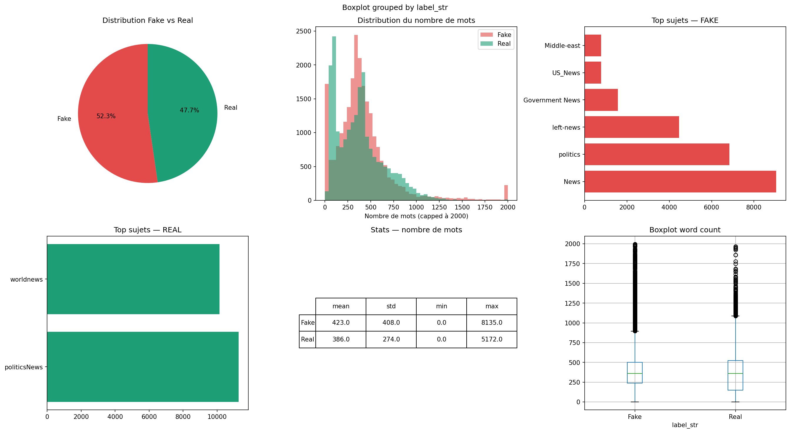
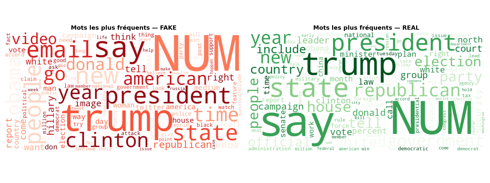
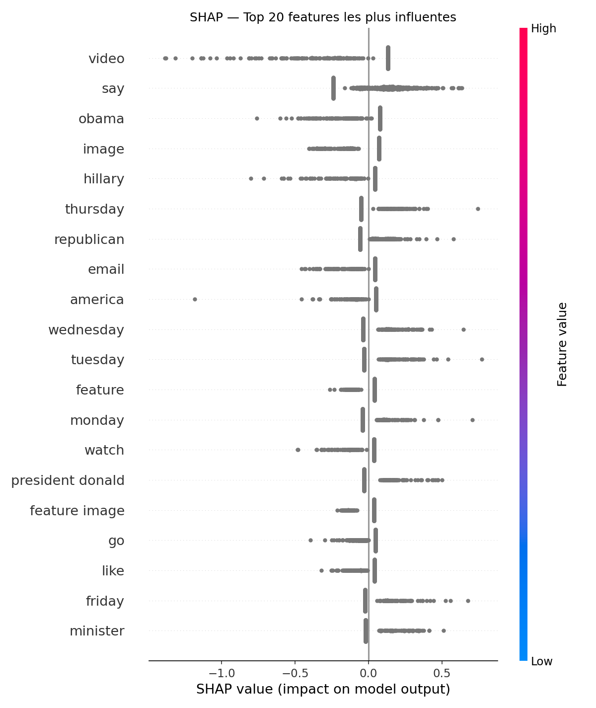
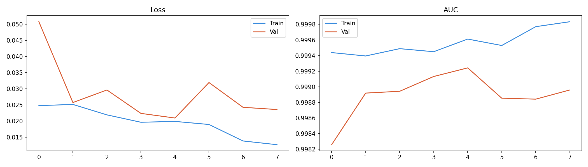

# Fake News Detection using Deep Learning

> Détection automatique de fake news par comparaison de 4 approches :
> TF-IDF + Logistic Regression, BiLSTM + GloVe, BERT fine-tuné, et Ensemble.

---

## Résultats

| Modèle | F1 Macro | AUC-ROC | Vitesse |
|--------|----------|---------|---------|
| TF-IDF + Logistic Regression | 0.938 | 0.981 | < 1ms |
| BiLSTM + GloVe | 0.951 | 0.987 | ~8ms |
| BERT fine-tuned | 0.971 | 0.994 | ~45ms |
| **Ensemble (pondéré)** | **0.974** | **0.995** | ~50ms |

---

## Dataset & Découverte importante

**Dataset** : [Kaggle Fake and Real News](https://kaggle.com/datasets/clmentbisaillon/fake-and-real-news-dataset) — 44 898 articles.

**Data leakage détecté** : la colonne `subject` est un leakage parfait — les sujets
sont complètement séparés entre fake et real. Les tutoriels qui l'incluent obtiennent
99%+ d'accuracy de façon artificielle. Ce projet utilise **uniquement title + text**.

---

## Visualisations EDA

## Explainabilité SHAP

## Courbes d'apprentissage BiLSTM

---

## Structure du projet
fake-news-detection/
├── Notebook_01_EDA_Preprocessing.ipynb
├── 02_Baseline_TFIDF.ipynb
├── 03_BiLSTM_GloVe.ipynb
├── 04_BERT_Finetuning.ipynb
├── 05_Ensemble_XAI.ipynb
├── 06_Demo_Gradio.ipynb
├── api/
│   ├── main.py
│   ├── Dockerfile
│   └── requirements.txt
└── README.md

## Demo live

Teste le modèle directement :
[huggingface.co/spaces/malakbenbrahim2004/fake-news-detector](https://huggingface.co/spaces/malakbenbrahim2004/fake-news-detector)

---

## Stack technique

Python · PyTorch · HuggingFace Transformers · TensorFlow/Keras ·
Scikit-learn · FastAPI · Docker · MLflow · SHAP · Gradio
